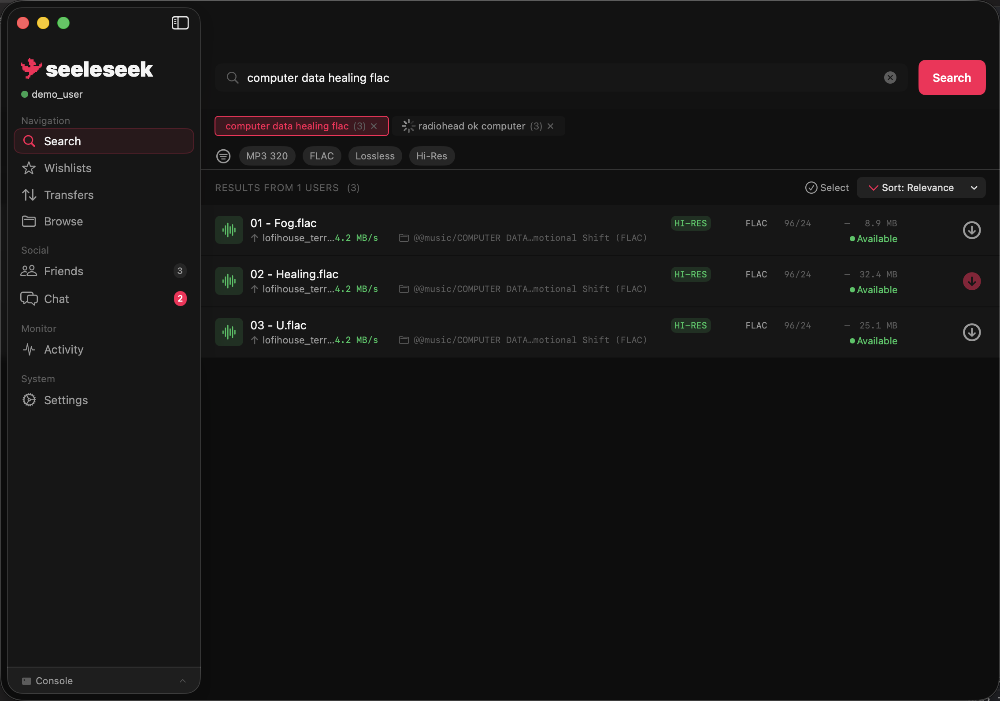

# seeleseek

seeleseek is a native macOS client for the soulseek protocol.

## Overview

seeleseek is a modern, native macOS client for the soulseek protocol. It provides a clean and intuitive interface for searching, downloading, and sharing files on the soulseek network.

[Docs](https://seeleseek.net)

## Installation

### Prerequisites
- macOS 15+

### From GitHub Releases

1. Download the latest release from the [Releases](https://github.com/bretth18/seeleseek/releases) page. Unsigned builds are available in from the `.zip` assets. It's recommended to use the `.pkg` signed installer for ease of use.
2. Open the app. You may need to approve it in System Preferences > Security & Privacy > General.

## Uninstallation
1. Quit the app.
2. Delete the app from the Applications folder.

## Dependencies
- [GRDB](https://github.com/groue/GRDB.swift)

## Contributing
Contributions are welcome, Please open an issue or submit a pull request.

### Reporting Issues
If you encounter any bugs or have feature requests, please open an issue on the [GitHub Issues](https://github.com/bretth18/seeleseek/issues) page.

## Development

### Prerequisites
- Xcode 16+ (Swift 6)

### Architecture
The core networking and protocol implementation lives in a local Swift Package at `Packages/SeeleseekCore/`. The app target imports this package and adds UI-specific extensions.

- **SeeleseekCore** — Protocol encoding/decoding, server/peer connections, download/upload management, models
- **seeleseek** — SwiftUI app, feature states, design system, database layer

### Documentation Site
A SvelteKit based marketing + documentation site lives in this repo under `/site`

### Setup
1. Clone the repository.
2. Open `seeleseek.xcodeproj` (the local package resolves automatically).
3. (Optional) [Set up GeoIP](#setting-up-geoip) for peer country flags.

### Build
Run `xcodebuild` or use Xcode.

### Setting up GeoIP
Peer country flags (in browse views, the monitor, etc.) are resolved locally
against a MaxMind GeoLite2-Country database. The `.mmdb` file can't be
committed to this repo — MaxMind's EULA prohibits redistribution.

Without the database, lookups return `nil` and flags are omitted; the app
runs fine, you just don't get geolocation.

To enable it:
1. Create a free account at https://www.maxmind.com/en/geolite2/signup
2. Generate a license key and download `GeoLite2-Country.mmdb`.
3. Drag the file into the `seeleseek` app target in Xcode ("Copy items if
   needed", "Add to targets: seeleseek"). It should appear under
   **Copy Bundle Resources** in the build phases.
4. Rebuild. The log "GeoIP database loaded: GeoLite2-Country (...)" confirms
   it's working.

MaxMind refreshes the database biweekly; plan for periodic updates if accuracy
matters to you. Attribution: "IP geolocation by MaxMind — maxmind.com".

**CI/Release builds** fetch the database automatically via a reusable composite
action at `.github/actions/fetch-geolite2`, invoked from `release.yml`. This
requires a repo secret named `MAXMIND_LICENSE_KEY`. If the secret isn't set,
tagged releases will fail at the "Fetch GeoLite2 Country database" step. The
`build.yml` CI (PRs, main branch) does NOT need the secret — unit tests use
a committed Apache-licensed fixture instead.

### CI/CD
GitHub Actions is configured to build and release the app on push to `main`.

## License

[MIT](./LICENSE)

## Acknowledgments

- [SoulSeek](https://www.slsknet.org)
- [Nicotine+](https://nicotine-plus.org) (protocol reference)
- [MusicBrainz](https://musicbrainz.org/) (metadata services)
- [GRDB](https://github.com/groue/GRDB.swift)
